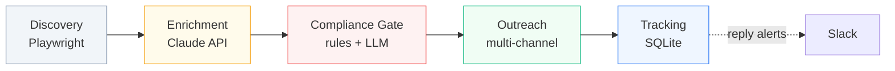

# KOL Discovery Pipeline · Architecture Showcase

> An end-to-end automation pipeline for discovering, qualifying, and engaging
> Key Opinion Leaders (KOLs) across X, YouTube, Instagram, and Telegram —
> built around `Python + Playwright + Claude API + SQLite`.

**This repository is an architecture and design showcase, not a runnable
product.** The proprietary scoring logic, compliance rules, and outreach
templates that I run for clients live in private repos. What's published
here is the open-source-shaped scaffolding: directory layout, module
boundaries, design decisions, and the data model.

If you want to see how I think about building automation pipelines for
business-development teams, you're in the right place. If you want to hire
me to build one for your stack, jump to [Hire me](#hire-me).

---

## Why this exists

Most BD teams in crypto / fintech / B2B do KOL discovery the same way:

1. A senior operator manually scrolls X, YouTube, IG, Telegram looking for
   creators who fit a niche.
2. The "good ones" get pasted into a Google Sheet.
3. The sheet is stale by Friday.
4. Compliance gets looped in only after a creator is already onboarded.
5. Funnel reporting is at the program level, not the partner level — so
   the team can't tell which KOLs actually move conversion.

That stack tops out at ~50 partnerships a quarter and burns 12–15 hours
a week of senior-operator time. This pipeline replaces it.

---

## What it does



**Stage 1 — Discovery.** Headless Playwright workers scan four platforms
on a configurable schedule, extracting creator profiles into a uniform
schema. New platforms drop in by writing one module that implements the
`PlatformScraper` interface (see [`docs/architecture.md`](./docs/architecture.md)).

**Stage 2 — Enrichment.** Each candidate is scored by Claude across
audience-niche match, language fit, real engagement rate, and posting
cadence. Cost: roughly $0.003 per lead. Cache hits make repeat scans
near-free.

**Stage 3 — Compliance Gate.** Six deterministic checks (jurisdiction,
sanctions, regulated content, brand safety, disclosure standards,
conflict of interest) run before any human ever sees the candidate. Pass
on first contact, every time.

**Stage 4 — Outreach.** Channel-specific senders (Email / Instagram DM /
FB Messenger / YouTube comments). Throttled, randomized, with credibility
anchors. The message body is templated and personalized via Claude using
real signals from the creator's recent content.

**Stage 5 — Tracking.** Every action lands in SQLite (or Postgres for
production) with full per-partner funnel resolution: reach → click →
registration → first deposit → first trade → retention. Slack alerts on
replies.

---

## Real-world numbers

Live use case: Taiwan-market crypto exchange KOL pipeline.

|  Metric                            | Result                          |
| ---------------------------------- | ------------------------------- |
| Candidates scanned per cycle       | **5,234**                       |
| Qualified leads after filtering    | **287**                         |
| Compliance pass rate (first send)  | **100%**                        |
| Manual operator hours saved / week | **~12**                         |
| Scaled platforms                   | **4** (X, YouTube, IG, Telegram) |
| Per-lead enrichment cost           | **~$0.003**                     |

---

## Repository layout

```
kol-discovery-pipeline/
├── README.md                 # this file
├── docs/
│   ├── architecture.md       # deep dive on system design
│   ├── compliance.md         # the 6 compliance checkpoints
│   ├── scoring-rubric.md     # discovery & enrichment scoring weights
│   └── data-model.md         # SQLite / Postgres schema notes
├── pipeline/                 # (private repo — abstract listed here)
│   ├── discovery/            # PlatformScraper implementations
│   │   ├── x.py
│   │   ├── youtube.py
│   │   ├── instagram.py
│   │   └── telegram.py
│   ├── enrichment/           # Claude API qualification
│   ├── compliance/           # rules + LLM review
│   ├── outreach/             # multi-channel senders
│   ├── tracking/             # funnel state machine
│   └── orchestrator/         # cron-driven coordinator
├── infra/
│   ├── deploy.sh             # one-shot deploy template
│   └── .env.example
├── LICENSE
└── .gitignore
```

The `pipeline/` directory in this public repo is intentionally empty —
it documents the module structure without exposing the proprietary logic.

---

## Design principles

1. **Modular by stage.** Each stage talks to the next over a well-typed
   interface. Swap Playwright for Puppeteer, Claude for Gemini, SQLite
   for Postgres — without rewriting the rest of the pipeline.

2. **Compliance is a gate, not a filter.** Every candidate clears the
   gate *before* a human writes them a message. Catching issues after
   outreach is 50× more expensive than catching them before.

3. **Per-partner funnel resolution.** Aggregate metrics lie. Track every
   creator from impression to retention so the budget can flow to the
   ones who actually convert.

4. **Throttle to look human.** Random delays, daily caps per channel,
   never two messages from the same identity within the same hour. Bots
   get burned; thoughtful operators don't.

5. **Storage is replaceable.** SQLite is the default for portability;
   Postgres for production beyond ~100K rows. Schema-compatible.

---

## Adapting the architecture to other niches

The pipeline shape — Discover → Enrich → Compliance → Outreach → Track —
isn't crypto-specific. I've sketched (or built variants of) the same
architecture for:

- **B2B SaaS prospecting** — LinkedIn / company-blog / job-board scraping,
  ICP qualification, multi-stage email sequences.
- **E-commerce affiliate sourcing** — Instagram / TikTok / YouTube,
  product-fit scoring, attribution-tagged outreach.
- **Real estate lead-gen** — listing-site monitoring, geographic /
  budget filtering, SMS + email outreach.
- **Recruiter sourcing** — GitHub / Stack Overflow / Twitter, skill
  match scoring, candidate outreach.

The platform modules and the prompts change. The scaffolding is the same.

---

## Tech stack

| Layer             | Choice                               | Why                              |
| ----------------- | ------------------------------------ | -------------------------------- |
| Browser automation| Playwright (Python)                  | Better anti-bot resilience than Selenium; chromium / firefox / webkit |
| LLM enrichment    | Anthropic Claude API                 | Strongest cost-per-quality I've measured for classification + drafting |
| Storage           | SQLite (dev) / Postgres (prod)       | Portable; same SQL surface       |
| Outreach          | Gmail API · IG private API · YouTube Data API · Telegram Bot API | Channel-native, throttle-friendly |
| Notifications     | Slack incoming webhooks              | Where my BD team already lives   |
| Scheduling        | Plain cron (k8s CronJob in prod)     | Boring is good                   |
| Language          | Python 3.11+                         | Strong async, mature scraping ecosystem |

---

## Hire me

I'm Benson — a senior BD operator who codes my own automation. I run a
production version of this pipeline as my day job at Pionex (派網) and I
freelance on Upwork building variants of it for other teams.

Typical engagements:

- **End-to-end pipeline build** ($2,000–$6,000 fixed) — I take a niche
  spec and ship a working version of the stages above in 2–4 weeks.
- **KOL / affiliate program audit** ($1,500–$4,000 fixed) — I review your
  current program and give you a written playbook of what's broken
  and how to fix it.
- **APAC / Taiwan market-entry consulting** — hourly or retainer.

📧 h3795592@gmail.com  ·  💼 [LinkedIn](https://www.linkedin.com/in/benson-yang-web3)
·  🐙 [GitHub](https://github.com/bensonyangweb3)

---

## License

MIT. See [LICENSE](./LICENSE).

The architecture documentation and code patterns in this repository are
free to study, fork, and adapt. The proprietary scoring rubrics, prompt
libraries, and compliance rule sets used in client engagements are not
included here.
